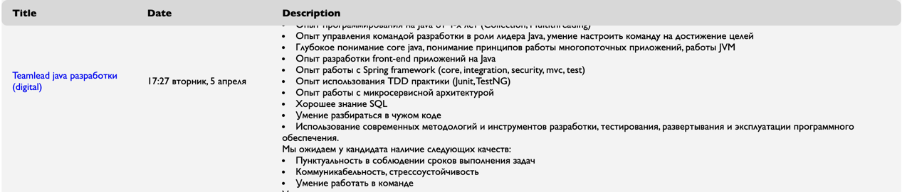

# job4j_grabber

This project represents a job search aggregator.

---
The system starts on schedule.
The launch period is specified in the settings file - app.properties.

The program reads all vacancies related to Java and writes them to the database.

The interface is accessed via the REST API.

#### Extensions:

1. New sites can be added to the project without changing the code.

2. In the project, you can do parallel parsing of sites.

#### Used technologies:

- JSOUP for parsing
- JDBC for manipulating with DB
- Quartz library for scheduling
- Slf4j for logging
-----
  
  